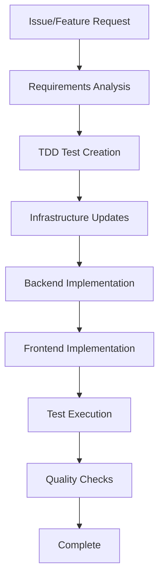

# Contributing to Everyday Rhythm

This guide helps contributors work effectively with the Everyday Rhythm project. This Python-based rhythm game uses Pygame and Amazon Q Developer for automatic stage generation.

## 🤖 For AI Agents

This section provides guidelines for AI agents (Claude, Cursor, etc.) to efficiently progress development in any project using this starter kit.

### 📋 Development Process Flow



### 🎯 Step-by-Step Implementation Guide

#### 1. Requirements Analysis (`docs/specs/`)
```bash
# File naming: F-XX-feature-name.md
# Example: F-01-rhythm-engine.md
```

**Required Sections:**
- Summary: Feature overview
- User Stories: User story format
- Technical Requirements: Python modules and dependencies
- Game Design: Gameplay mechanics and UI design
- Audio Integration: Music processing and timing requirements
- Amazon Q Integration: Stage generation specifications
- Acceptance Criteria: Testable acceptance criteria

#### 2. TDD Test Creation (`tests/`)
```python
# Example: Game module testing
import pytest
import pygame
from src.core.rhythm_engine import RhythmEngine
from src.core.game_manager import GameManager

class TestRhythmEngine:
    def setup_method(self):
        """Setup test environment"""
        pygame.init()
        self.rhythm_engine = RhythmEngine()
    
    def teardown_method(self):
        """Cleanup after tests"""
        pygame.quit()
    
    def test_note_timing_accuracy(self):
        """Test rhythm timing accuracy within 50ms tolerance"""
        # Arrange
        note_time = 1000  # 1 second
        input_time = 1030  # 30ms late
        
        # Act
        result = self.rhythm_engine.evaluate_timing(note_time, input_time)
        
        # Assert
        assert result.accuracy == "good"
        assert result.timing_diff == 30
        assert result.score > 0
    
    def test_stage_loading(self):
        """Test JSON stage file loading"""
        # Arrange
        stage_path = "tests/fixtures/test_stage.json"
        
        # Act
        stage = self.rhythm_engine.load_stage(stage_path)
        
        # Assert
        assert stage is not None
        assert "notes" in stage
        assert len(stage["notes"]) > 0
```

#### 3. Module Implementation (`src/`)
```python
# Example: Game module implementation
import pygame
import json
from typing import Dict, List, Optional
from src.utils.config import Config

class AudioManager:
    """Manages audio playback and timing synchronization"""
    
    def __init__(self):
        pygame.mixer.init(buffer=Config.AUDIO_BUFFER_SIZE)
        self.current_music: Optional[pygame.mixer.Sound] = None
        self.start_time: float = 0
    
    def load_music(self, file_path: str) -> bool:
        """Load music file for playback"""
        try:
            self.current_music = pygame.mixer.Sound(file_path)
            return True
        except pygame.error as e:
            print(f"Failed to load music: {e}")
            return False
    
    def play_music(self) -> None:
        """Start music playback and record start time"""
        if self.current_music:
            self.current_music.play()
            self.start_time = pygame.time.get_ticks()
    
    def get_current_time(self) -> float:
        """Get current playback time in milliseconds"""
        return pygame.time.get_ticks() - self.start_time
    
    def stop_music(self) -> None:
        """Stop music playback"""
        pygame.mixer.stop()
```

#### 4. Amazon Q Integration (`src/stages/`)
```python
# Example: Amazon Q Developer integration
import requests
import json
from typing import Dict, Any
from src.utils.config import Config

class StageGenerator:
    """Generate game stages using Amazon Q Developer API"""
    
    def __init__(self):
        self.api_key = Config.AMAZON_Q_API_KEY
        self.endpoint = Config.AMAZON_Q_ENDPOINT
    
    async def generate_stage(self, prompt: str, audio_file: str) -> Dict[str, Any]:
        """Generate stage from natural language prompt and audio file"""
        try:
            # Analyze audio file
            audio_analysis = self._analyze_audio(audio_file)
            
            # Create prompt for Amazon Q
            full_prompt = self._create_prompt(prompt, audio_analysis)
            
            # Call Amazon Q API
            response = await self._call_amazon_q_api(full_prompt)
            
            # Process and validate response
            stage_data = self._process_response(response)
            
            return stage_data
            
        except Exception as e:
            print(f"Stage generation failed: {e}")
            return self._create_fallback_stage()
    
    def _analyze_audio(self, audio_file: str) -> Dict[str, Any]:
        """Analyze audio file for tempo and rhythm patterns"""
        import librosa
        
        # Load audio file
        y, sr = librosa.load(audio_file)
        
        # Extract tempo and beats
        tempo, beats = librosa.beat.beat_track(y=y, sr=sr)
        
        return {
            "tempo": float(tempo),
            "beats": beats.tolist(),
            "duration": len(y) / sr
        }
```

#### 5. UI Implementation (`src/ui/`)
```python
# Example: Pygame UI component implementation
import pygame
from typing import Tuple, Optional
from src.utils.config import Config

class GameRenderer:
    """Handles game UI rendering and visual feedback"""
    
    def __init__(self, screen: pygame.Surface):
        self.screen = screen
        self.font = pygame.font.Font(None, 36)
        self.colors = {
            'background': (0, 0, 0),
            'note': (255, 255, 255),
            'hit': (0, 255, 0),
            'miss': (255, 0, 0),
            'text': (255, 255, 255)
        }
    
    def render_game_state(self, game_state: Dict[str, Any]) -> None:
        """Render current game state"""
        # Clear screen
        self.screen.fill(self.colors['background'])
        
        # Render score
        self._render_score(game_state['score'])
        
        # Render notes
        self._render_notes(game_state['notes'])
        
        # Render timing feedback
        if game_state.get('last_hit'):
            self._render_feedback(game_state['last_hit'])
        
        # Update display
        pygame.display.flip()
    
    def _render_score(self, score: int) -> None:
        """Render current score"""
        score_text = self.font.render(f"Score: {score}", True, self.colors['text'])
        self.screen.blit(score_text, (10, 10))
    
    def _render_notes(self, notes: List[Dict]) -> None:
        """Render active notes on screen"""
        for note in notes:
            if note['active']:
                pos = self._calculate_note_position(note)
                pygame.draw.circle(self.screen, self.colors['note'], pos, 20)
```

### 🛠️ Code Quality Checklist

Before completing implementation, verify:

- [ ] Python syntax check passes (`python -m py_compile src/**/*.py`)
- [ ] All tests pass (`pytest tests/`)
- [ ] Code style check passes (`flake8 src/`)
- [ ] Code formatting is consistent (`black src/ tests/`)
- [ ] Type hints are properly used
- [ ] Game runs without crashes (`python main.py`)
- [ ] Audio playback works correctly
- [ ] Performance requirements met (60 FPS, <50ms audio latency)
- [ ] Documentation updated

### 📁 File Path Templates

Standard file paths for new features:

```
docs/specs/F-XX-feature-name.md                    # Specification
src/core/feature/                                   # Core game modules
src/audio/feature/                                  # Audio processing modules
src/ui/feature/                                     # UI rendering modules
src/stages/feature/                                 # Stage generation modules
src/utils/feature/                                  # Utility functions
assets/audio/feature/                               # Audio assets
assets/images/feature/                              # Image assets
stages/feature/                                     # Stage JSON files
tests/unit/feature/                                 # Unit tests
tests/integration/feature/                          # Integration tests
tests/fixtures/feature/                             # Test data
```

Refer to [docs/ARCHITECTURE.md](docs/ARCHITECTURE.md) for detailed module organization.

### 🚨 Common Pitfalls for AI Agents

**Avoid these implementation patterns:**

1. **Hardcoded Configuration**
   ```python
   # ❌ Bad - Hardcoded values
   WINDOW_WIDTH = 800
   WINDOW_HEIGHT = 600
   API_KEY = "hardcoded-api-key"
   
   # ✅ Good - Configuration management
   from src.utils.config import Config
   
   WINDOW_WIDTH = Config.GAME_WINDOW_WIDTH
   WINDOW_HEIGHT = Config.GAME_WINDOW_HEIGHT
   API_KEY = Config.AMAZON_Q_API_KEY
   ```

2. **Inefficient Resource Management**
   ```python
   # ❌ Bad - Loading resources repeatedly
   def render_frame():
       font = pygame.font.Font(None, 36)  # Loaded every frame
       image = pygame.image.load("sprite.png")  # Loaded every frame
   
   # ✅ Good - Resource caching
   class ResourceManager:
       def __init__(self):
           self.fonts = {}
           self.images = {}
       
       def get_font(self, size):
           if size not in self.fonts:
               self.fonts[size] = pygame.font.Font(None, size)
           return self.fonts[size]
   ```

3. **Missing Error Handling**
   ```python
   # ❌ Bad - No error handling
   sound = pygame.mixer.Sound(audio_file)
   sound.play()
   
   # ✅ Good - Proper error handling
   try:
       sound = pygame.mixer.Sound(audio_file)
       sound.play()
   except pygame.error as e:
       print(f"Failed to play audio: {e}")
       # Fallback behavior
   ```

4. **Performance Issues**
   ```python
   # ❌ Bad - Inefficient collision detection
   for note in notes:
       for other_note in notes:
           if note != other_note and check_collision(note, other_note):
               handle_collision(note, other_note)
   
   # ✅ Good - Optimized collision detection
   active_notes = [note for note in notes if note.active]
   for i, note in enumerate(active_notes):
       for other_note in active_notes[i+1:]:
           if check_collision(note, other_note):
               handle_collision(note, other_note)
   ```

### 🔄 Testing Strategy

#### Unit Testing
```bash
pytest tests/unit/              # Unit tests
pytest tests/unit/ --watch      # Watch mode (with pytest-watch)
pytest tests/unit/ --cov=src    # Coverage report
```

#### Integration Testing
```bash
pytest tests/integration/       # Integration tests
python -m pytest tests/integration/test_audio.py  # Audio system tests
python -m pytest tests/integration/test_amazon_q.py  # Amazon Q API tests
```

#### Game Testing
```bash
python main.py --test-mode      # Test mode with automated input
python tests/manual/test_gameplay.py  # Manual gameplay testing
```

#### Performance Testing
```bash
python tests/performance/test_fps.py      # Frame rate testing
python tests/performance/test_latency.py  # Audio latency testing
```

### 📚 Reference Documentation

- [Product Requirements](docs/prd.md)
- [System Architecture](docs/ARCHITECTURE.md)
- [Technology Stack](docs/tech-stack.md)
- [Implementation Plan](docs/implementation-plan.md)
- [Architecture Decision Records](decisions/)

## 👥 For Human Contributors

### Prerequisites
- Python 3.10+
- pip package manager
- Git
- macOS Sonoma (14.x) or higher
- Audio output device

### Project Setup
```bash
git clone https://github.com/daktu32/everyday-rhythm.git
cd everyday-rhythm

# Create virtual environment
python3 -m venv venv
source venv/bin/activate

# Install dependencies
pip install -r requirements.txt

# Set up environment variables
cp .env.example .env
# Edit .env with your Amazon Q Developer API key

# Test installation
python main.py
```

### Development Workflow

#### 1. Core Game Development
```bash
# Activate virtual environment
source venv/bin/activate

# Run game in development mode
python main.py --debug

# Run tests
pytest tests/

# Check code quality
flake8 src/
black src/ tests/
```

#### 2. Audio System Development
```bash
# Test audio functionality
python tests/manual/test_audio.py

# Analyze audio files
python src/utils/audio_analyzer.py assets/audio/sample.wav

# Test Amazon Q integration
python tests/integration/test_stage_generation.py
```

#### 3. Stage Development
```bash
# Generate new stage
python src/stages/generator.py "朝の歯磨き" assets/audio/morning.wav

# Validate stage JSON
python src/utils/stage_validator.py stages/morning_routine.json

# Test stage playback
python main.py --stage stages/morning_routine.json
```

### Environment Management

#### Development Environment
```bash
# Activate development environment
source venv/bin/activate
export ENVIRONMENT=development

# Run with debug logging
python main.py --debug --log-level DEBUG
```

#### Testing Environment
```bash
# Run comprehensive tests
pytest tests/ --cov=src --cov-report=html

# Performance testing
python tests/performance/benchmark.py
```

#### Production Environment
```bash
# Create distribution package
python setup.py sdist bdist_wheel

# Run optimized version
python main.py --optimize
```

### Git Workflow
1. Create feature branch from main
2. Follow specification → test → infrastructure → implementation flow
3. Verify all tests pass
4. Create Pull Request with proper documentation

## 📝 Documentation Standards

### Commit Messages
```
feat(api): Add user authentication endpoint
fix(frontend): Resolve login form validation
infra(stack): Add database connection pooling
test: Add integration tests for user service
docs: Update architecture documentation
```

### Pull Request Guidelines
- Reference related issue numbers
- Include implementation summary
- Document infrastructure changes and cost impact
- Ensure all tests pass
- Request appropriate reviewers

## 🔐 Security Guidelines

### API Key Management
- Store Amazon Q Developer API key in environment variables
- Never commit API keys to version control
- Use different API keys for development and production
- Implement API rate limiting and error handling

### Data Protection
- Validate all user input (audio files, stage data)
- Sanitize file paths to prevent directory traversal
- Implement proper error handling without exposing sensitive information

### Local Security
```python
# Environment variable validation
import os
from typing import Optional

def get_api_key() -> Optional[str]:
    """Safely retrieve API key from environment"""
    api_key = os.getenv('AMAZON_Q_API_KEY')
    if not api_key:
        raise ValueError("AMAZON_Q_API_KEY environment variable not set")
    return api_key

# Input validation
def validate_audio_file(file_path: str) -> bool:
    """Validate audio file path and format"""
    import os
    
    # Check file exists and is readable
    if not os.path.isfile(file_path):
        return False
    
    # Check file extension
    allowed_extensions = ['.wav', '.mp3']
    if not any(file_path.lower().endswith(ext) for ext in allowed_extensions):
        return False
    
    return True
```

## 🚀 Performance Guidelines

### Backend Optimization
- Implement connection pooling
- Use appropriate caching strategies
- Optimize database queries
- Implement proper monitoring

### Frontend Optimization
- Implement code splitting
- Optimize bundle sizes
- Use appropriate caching headers
- Implement progressive loading

### Infrastructure Optimization
- Right-size compute resources
- Implement auto-scaling
- Use content delivery networks
- Monitor and optimize costs

## 📊 Monitoring & Debugging

### Logging Best Practices
```typescript
// Structured logging
import { logger } from '../utils/logger';

export const handler = async (event) => {
  logger.info('Processing request', { 
    requestId: event.requestContext.requestId,
    path: event.path 
  });
  
  try {
    const result = await processRequest(event);
    logger.info('Request completed', { 
      requestId: event.requestContext.requestId,
      duration: Date.now() - startTime 
    });
    return result;
  } catch (error) {
    logger.error('Request failed', { 
      requestId: event.requestContext.requestId,
      error: error.message,
      stack: error.stack 
    });
    throw error;
  }
};
```

### Metrics and Monitoring
```typescript
// Custom metrics
import { metrics } from '../utils/metrics';

export const recordBusinessMetric = async (metricName: string, value: number) => {
  await metrics.putMetric({
    name: metricName,
    value: value,
    unit: 'Count',
    timestamp: new Date()
  });
};
```

## 🆘 Getting Help

- Create GitHub Issues for bugs and feature requests
- Use GitHub Discussions for questions
- Refer to project-specific documentation
- Check [docs/setup-guide.md](docs/setup-guide.md) for environment setup

## 📄 License

This starter kit is provided under MIT License. See [LICENSE](LICENSE) for details.
Individual projects using this starter kit may have different licensing terms.