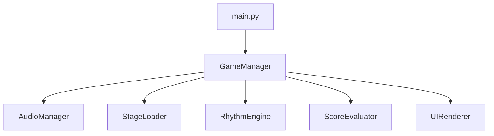

# Architecture Design Document

## 1. システム構成概要



## 2. モジュール構成

| モジュール | 概要 |
|-----------|------|
| main.py | 起動・ループ管理 |
| game_manager.py | ゲーム全体の状態制御 |
| audio_manager.py | 音楽の再生・時刻取得 |
| stage_loader.py | ステージJSONの読み込み |
| rhythm_engine.py | ノートとキー入力の照合 |
| score_evaluator.py | 判定結果からスコア算出 |
| ui_renderer.py | 判定結果と画面描画処理 |

## 3. データ構造（ステージテンプレート）

```json
{
  "title": "朝の歯磨き",
  "bpm": 100,
  "audio_file": "brushing_teeth.wav",
  "notes": [
    {"time_ms": 1000, "action": "tap"},
    {"time_ms": 2000, "action": "tap"}
  ]
}
```

## 4. ゲームループ構成

```
while True:
    1. 入力取得
    2. 現在時刻取得
    3. ノートと照合
    4. 判定とスコア更新
    5. 描画更新
```

## 5. ディレクトリ構成（MVP）

```
everyday_rhythm/
├── main.py
├── config/
│   └── settings.py
├── core/
│   ├── game_manager.py
│   ├── audio_manager.py
│   ├── stage_loader.py
│   ├── rhythm_engine.py
│   ├── score_evaluator.py
│   └── ui_renderer.py
├── stages/
│   └── sample_stage.json
├── assets/
│   ├── audio/
│   ├── images/
│   └── fonts/
├── utils/
│   └── time_sync.py
├── requirements.txt
└── README.md
```

## 6. 拡張予定

- editor/: GUIステージエディタ  
- q_client/: Amazon Q 連携モジュール群  
- tests/: ユニットテスト・E2E用  
- scripts/: ステージ自動生成や変換スクリプト  

---
**Author**: 塚原大輔  
**Version**: 0.1  
**Last Updated**: 2025-06-15
